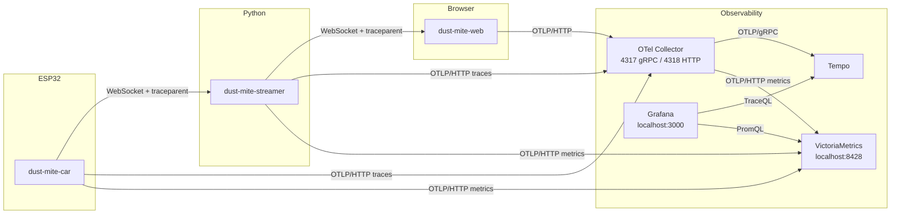

# Contributing to dust-mite

Contributions are welcome.
This repository is an experimental platform, and contributions that improve technical clarity, learning value, and iteration speed are prioritized.

## Ground rules

- Keep changes focused and easy to review.
- Prefer small pull requests over large rewrites.
- Preserve existing style and tooling unless a change explicitly updates them.
- Follow classical TDD: use real collaborators in tests instead of mocks or stubs.
- Open or reference a GitHub Issue for bugs, tasks, and larger proposals.

## Prerequisites

- Docker
- VS Code with Dev Containers support

## Initial setup

From repository root:

```bash
./scripts/install_git_hooks.sh
```

This installs a Git pre-commit hook that can run project checks.

The hook delegates to container-specific pre-commit scripts via `PRE_COMMIT_SCRIPT` configured in each devcontainer.

## Development environment

This project is designed to be developed in VS Code Dev Containers.
Use devcontainers as the default workflow for all contributions.
Define shared default VS Code settings in the relevant devcontainer configuration instead of local `.vscode/settings.json` files.

Available environments:

- [.devcontainer/python/](.devcontainer/python/) for [controller/](controller/) work (controller app and Raspberry Pi camera service code quality checks)
- [.devcontainer/cpp/](.devcontainer/cpp/) for [car/](car/) firmware work
- [.devcontainer/js/](.devcontainer/js/) for [web/](web/) frontend work (bundler, linter, formatter, local dev server)
- [.devcontainer/docs/](.devcontainer/docs/) for [docs/](docs/) updates (diagrams and image processing)

There is currently no dedicated Raspberry Pi devcontainer profile. Use the Python devcontainer for shared lint/type/test workflows, and run Raspberry Pi camera runtime validation directly on Raspberry Pi OS.

### Open the correct workspace in container

1. Open the repository in VS Code.
2. From repository root, generate [.env](.env):

   ```bash
   ./scripts/dump_env.sh
   ```

3. Edit [.env](.env) and provide correct values for your setup (for example Wi-Fi SSID/password and other required variables).
4. Open the target locally first in VS Code:
   - For [python.code-workspace](python.code-workspace), [cpp.code-workspace](cpp.code-workspace), or [js.code-workspace](js.code-workspace):
     1. Run `File: Open Workspace from File...`.
     2. Choose [python.code-workspace](python.code-workspace) for [controller/](controller/) work, [cpp.code-workspace](cpp.code-workspace) for [car/](car/) work, or [js.code-workspace](js.code-workspace) for [web/](web/) work.
   - For docs work: no additional action is required; continue with the repository root opened in step 1.
5. If you need hardware passthrough (for example controller or ESP32 device access), manually uncomment the `devices:` entries in:
   - [.devcontainer/python/docker-compose.yml](.devcontainer/python/docker-compose.yml)
   - [.devcontainer/cpp/docker-compose.yml](.devcontainer/cpp/docker-compose.yml)
6. Run `Dev Containers: Reopen in Container` and choose the matching devcontainer (`Python`, `C++`, or `Docs`).

The container image includes project dependencies and VS Code extensions required for that stack. On first open, the devcontainer installs the controller package into the virtual environment via `postCreateCommand`.

#### Rationale for VS Code workspace files

- A plain single-root workspace is not suitable for this repository layout when using the ESP-IDF extension. The extension expects the workspace root to match an ESP-IDF project structure (see the [ESP-IDF example project layout](https://docs.espressif.com/projects/esp-idf/en/latest/esp32/api-guides/build-system.html#example-project)).
- Pointing `workspaceFolder` directly to [car/](car/) enables reliable ESP-IDF tooling, but editing files at repository root (for example docs or devcontainer config) becomes terminal-only and inefficient.
- Using [cpp.code-workspace](cpp.code-workspace) keeps [car/](car/) as the active project while still exposing the repository root in the same VS Code session.
- Keep workspace files (for example [cpp.code-workspace](cpp.code-workspace) and [python.code-workspace](python.code-workspace)) at repository root. If a `.code-workspace` file is stored in a subfolder, Dev Containers cannot resolve that subfolder's parent as the shared directory.

## Full stack development session

[docker-compose.yml](docker-compose.yml) at the repository root combines all devcontainer and observability services into a single compose project using [extends](https://docs.docker.com/compose/how-tos/multiple-compose-files/extends/).

### Byobu session

[scripts/start_byobu.sh](scripts/start_byobu.sh) starts all containers and opens a terminal session with four panes in a 2×2 grid:

| C++ serial monitor | Python streamer |
|---|---|
| JS dev server (`http://localhost:5173`) | OTel Collector logs |

From the repository root:

```bash
./scripts/start_byobu.sh
```

Each pane runs its workload in the corresponding container via `docker compose exec`. Press `Ctrl-C` to cancel a running command; the pane drops into an interactive shell in the same container. The C++ pane is an exception: `idf_monitor.py` runs in raw terminal mode and forwards `Ctrl-C` to the ESP32 as a break signal. Use `Ctrl-]` to exit the monitor; the pane then drops into an interactive shell.

Build and flash are performed separately in the C++ devcontainer. Use the byobu C++ pane to observe ESP32 serial output during a full-stack session.

Basic byobu navigation:

| Key | Action |
|---|---|
| `F12 :kill-session` | Kill session and stop all containers |
| `F6` | Detach from session (containers keep running); reattach with `byobu attach-session -t dust-mite` |
| `F12` + arrow | Move between panes |
| `F12 z` | Zoom current pane to full screen (repeat to unzoom) |

See the [byobu documentation](https://www.byobu.org/documentation) for the full key reference.

## Observability



The observability stack covers distributed tracing and real-time metrics. It comprises four tiers:

- **OTel Collector** (`otel/opentelemetry-collector-contrib`) — OTLP receiver on 4317 (gRPC) and 4318 (HTTP). Routes traces to Tempo and forwards browser metrics to VictoriaMetrics. Configuration: [observability/otelcol.yml](observability/otelcol.yml).
- **Grafana Tempo** — trace storage and query backend. Configuration: [observability/tempo.yml](observability/tempo.yml).
- **VictoriaMetrics** (`victoriametrics/victoria-metrics`) — metrics storage. Firmware and Python metrics are pushed directly via OTLP/HTTP; browser metrics arrive via the OTel Collector. Exposes a Prometheus-compatible query API at `http://localhost:8428`. Configuration: none required (all defaults).
- **Grafana** — visualization UI at `http://localhost:3000`. Tempo (default) and VictoriaMetrics datasources are auto-provisioned. A pre-built dashboard is available under **Dashboards → dust-mite**. Configuration: [observability/grafana/provisioning/](observability/grafana/provisioning/).

### Instrumented services

All three services export traces via OTLP/HTTP to the OTel Collector and metrics directly to VictoriaMetrics:

| Service | Name in Tempo | Traces endpoint | Metrics endpoint |
|---|---|---|---|
| ESP32 firmware | `dust-mite-car` | `http://<host-ip>:4318` (configured in [car/sdkconfig.defaults](car/sdkconfig.defaults)) | `CONFIG_ESP_OPENTELEMETRY_METRICS_OTLP_BASE_URL` + `/v1/metrics` |
| Python streamer | `dust-mite-streamer` | `OTEL_EXPORTER_OTLP_ENDPOINT` (default `http://otel-collector:4318`) | `OTEL_EXPORTER_OTLP_METRICS_ENDPOINT` (default `http://victoriametrics:8428/opentelemetry/v1/metrics`) |
| Web browser | `dust-mite-web` | `VITE_OTLP_ENDPOINT` (default `http://localhost:4318`) | `VITE_OTLP_METRICS_ENDPOINT` (default `http://localhost:4318`) via OTel Collector |

### Metrics

The set of emitted metrics is variant-specific. See the variant documentation in [docs/variants/](docs/variants/) for the full list. When adding or removing a metric, update the metrics table in the relevant variant document.

To verify the metrics pipeline is working:

```bash
# Query VictoriaMetrics (populated once metrics are being emitted):
curl -s 'http://localhost:8428/api/v1/query?query=up' | python3 -m json.tool

# Check a specific firmware metric:
curl -s 'http://localhost:8428/api/v1/query?query=dust_mite_task_cpu_usage_percent' | python3 -m json.tool
```

### Cross-service trace propagation

W3C `traceparent` is embedded as a field in every WebSocket JSON packet, linking spans across the firmware → streamer → browser path:

- Firmware: `tracing_inject()` / `tracing_extract()` in [car/components/tracing/tracing.hpp](car/components/tracing/tracing.hpp).
- Streamer: `inject_trace_context()` / `extract_trace_context()` in [controller/src/controller/tracing.py](controller/src/controller/tracing.py).
- Browser: `@opentelemetry/api` propagation via W3C `TraceContextPropagator` in [web/src/index.js](web/src/index.js).

### Adding spans

**ESP32 firmware (C++)** — use `esp_opentelemetry_tracer()` from `car/components/tracing/tracing.hpp`:

```cpp
// Simple span
auto span = esp_opentelemetry_tracer()->StartSpan("my.operation");
span->SetAttribute("key", "value");
span->End();

// Span linked to a parent extracted from an incoming JSON message
auto parent_ctx = tracing_extract(*json_obj);
opentelemetry::trace::StartSpanOptions opts;
opts.parent = opentelemetry::trace::GetSpan(parent_ctx)->GetContext();
auto span = esp_opentelemetry_tracer()->StartSpan(
    "my.operation", {{"attr", value}}, opts);
auto scope = opentelemetry::trace::Scope(span);
// ... work ...
span->End();
```

**Python streamer** — use the module-level `tracer` and helpers from `controller/src/controller/streamer.py` and `controller/src/controller/tracing.py`:

```python
# Decorator — span wraps the entire function
@tracer.start_as_current_span("my.operation")
def my_function():
    span = trace.get_current_span()
    span.set_attribute("key", "value")

# Span linked to a parent extracted from an incoming WebSocket JSON packet
packet: dict = json.loads(raw_message)
parent_ctx = extract_trace_context(packet)  # reads W3C traceparent from the dict
with tracer.start_as_current_span("my.operation", context=parent_ctx) as span:
    span.set_attribute("key", "value")
```

**Web browser (JavaScript)** — use the module-level `tracer` and `propagation` from `web/src/index.js`:

```js
// Span linked to a parent extracted from an incoming WebSocket JSON message
const carrier = { traceparent: event_data.traceparent, tracestate: event_data.tracestate };
const parentContext = propagation.extract(context.active(), carrier);
const span = tracer.startSpan("my.operation", {
    attributes: { "key": "value" },
}, parentContext);
try {
    // ... work ...
} finally {
    span.end();
}
```

### Viewing metrics

Open Grafana at `http://localhost:3000` → **Dashboards** → **dust-mite**. The dashboard shows all sensor readings and pipeline counters at 1 s resolution.

### Viewing traces

Open Grafana at `http://localhost:3000` → **Explore** → select the **Tempo** datasource → run a TraceQL query:

- `{}` — all traces
- `{resource.service.name="dust-mite-car"}` — firmware spans only
- `{resource.service.name="dust-mite-streamer"}` — streamer spans only

## Variants

Variants use code names based on chemical elements (for example `Copper`, `Iron`).

Each new variant must include:

- A dedicated logo in [docs/images/logos/](docs/images/logos/).
- Variant photos in [docs/images/](docs/images/).
- Variant documentation in [docs/variants/](docs/variants/).
- An entry in [docs/variants.md](docs/variants.md).

## Repository map

- [car/](car/) - ESP-IDF firmware for the RC car platform.
- [controller/](controller/) - Python controller, stream/telemetry integration, and Raspberry Pi camera service source under [controller/src/controller/rpi/camera.py](controller/src/controller/rpi/camera.py).
- [web/](web/) - JavaScript web frontend (camera stream display, telemetry dashboard).
- [docs/](docs/) - project documentation.
- [scripts/](scripts/) - repository-level helper scripts.

## Controller development ([controller/](controller/))

In the Python devcontainer, the workspace opens at `/workspaces/dust-mite/controller`.

### Run quality checks

```bash
./scripts/run_checks.sh
```

If checks fail, apply automatic fixes:

```bash
./scripts/fix_checks.sh
```

### Run tests

```bash
./scripts/run_tests.sh
```

### Controller test types

- Unit tests: validate individual controller modules and functions in isolation using focused test doubles where needed; implemented in [controller/tests/unit/](controller/tests/unit/).
- Integration tests: validate interactions across controller boundaries (for example websocket communication and packet flow) using multi-component test scenarios; implemented in [controller/tests/integration/](controller/tests/integration/).
- E2E tests: validate full user-level control flows across the complete stack (controller input to observable car behavior and outputs) in realistic deployment conditions; not implemented yet.

Run specific suites:

```bash
./scripts/run_tests.sh tests/unit
./scripts/run_tests.sh tests/integration
```

### Raspberry Pi camera service ([controller/src/controller/rpi/camera.py](controller/src/controller/rpi/camera.py))

Camera service code is developed with the same formatter/linter/type-checker settings as the rest of Python code in [controller/](controller/).

For Raspberry Pi provisioning, runtime requirements, and camera service execution workflow, use [docs/hw/rpi.md](docs/hw/rpi.md).

### Dependency management

Dependencies are managed with [pip-compile-multi](https://pypi.org/project/pip-compile-multi/).

The controller uses three requirement sets:

- `requirements/base.in` → `requirements/base.txt`: main controller runtime dependencies.
- `requirements/dev.in` → `requirements/dev.txt`: development tooling and test dependencies.
- `requirements/rpi.in` → `requirements/rpi.txt`: Raspberry Pi camera runtime dependencies.

Edit `.in` files only. Generated `.txt` files are pinned dependencies and should be updated via scripts.

#### Update and verify dependencies

```bash
./scripts/update_requirements.sh
./scripts/upgrade_requirements.sh
./scripts/upgrade_package.sh <package_name>
./scripts/run_requirements_checks.sh
```

## Web frontend development ([web/](web/))

In the JavaScript devcontainer, the workspace opens at `/workspaces/dust-mite/web`.

### Run quality checks

```bash
./scripts/run_checks.sh
```

If checks fail, apply automatic fixes:

```bash
./scripts/fix_checks.sh
```

### Start development server

```bash
./scripts/run_dev_server.sh
```

### Build for production

```bash
./scripts/run_build.sh
```

### Run tests

```bash
./scripts/run_tests.sh
```

### Web frontend test types

- Unit tests: validate individual modules and functions in isolation; implemented in [web/tests/unit/](web/tests/unit/).
- Integration tests: validate interactions across component boundaries; implemented in [web/tests/integration/](web/tests/integration/).
- E2E tests: validate full user-level flows in a browser; implemented in [web/tests/e2e/](web/tests/e2e/). Two variants:
  - Mock-based: uses an in-process WebSocket server; runs in CI.
  - Full-stack (`tests/e2e/full_stack.test.js`): runs against the real running stack; on-demand only, not run in CI.

Run specific suites:

```bash
./scripts/run_tests.sh tests/unit
./scripts/run_tests.sh tests/integration
./scripts/run_tests.sh tests/e2e
./scripts/run_tests.sh tests/e2e/full_stack
```

### Full-stack E2E tests

`tests/e2e/full_stack.test.js` runs Playwright against the real running stack. The `js` service bakes Docker-network service names into the served JavaScript, so the browser connects directly to the Python streamer and VictoriaMetrics without any URL patching.

Some tests require the car to be connected and active. Prerequisites: start the headless stack first.

```bash
./scripts/start_headless.sh
```

The headless stack includes the `test-runner` service (built from the JS devcontainer image, with Playwright and Firefox) running in standby. Execute tests inside it:

```bash
docker compose -f docker-compose.yml -f docker-compose.headless.yml exec test-runner scripts/run_tests.sh tests/e2e/full_stack
```

The test-runner connects to the `js` and `victoriametrics` containers over the Docker network; no port forwarding to the host is required.

The Vite dev server on port 5173 is provided by the `js` service. For visual inspection, open `http://localhost:5173` directly in a host browser.

## Car firmware development ([car/](car/))

[car/](car/) is an ESP-IDF project.
In the C++ devcontainer, the ESP-IDF environment is already configured.
The C++ devcontainer opens at `/workspaces/dust-mite/car`.

The firmware depends on vendored submodules (for example the OpenTelemetry C++ SDK under [car/components/esp-opentelemetry-cpp/third_party/](car/components/esp-opentelemetry-cpp/third_party/)). After cloning the repository, initialize submodules recursively:

```bash
git submodule update --init --recursive
```

Typical loop:

```bash
idf.py build
idf.py flash
idf.py monitor
```

### Run quality checks

```bash
./scripts/run_checks.sh
```

If checks fail, apply automatic fixes (only reformats lines you've already staged with `git add`):

```bash
./scripts/fix_checks.sh
```

#### clang-format

`run_checks.sh` runs `run_clang_format.sh`, which checks formatting with
[clang-format](https://clang.llvm.org/docs/ClangFormat.html) against the style defined in
[car/.clang-format](car/.clang-format). Like `run_clang_tidy.sh`, it sources
`$IDF_PATH/export.sh` itself so it always resolves to the `esp-clang`-bundled
`clang-format`/`git-clang-format`, regardless of caller context — there is no
separate apt `clang-format` package, which would otherwise drift in version
from `esp-clang`'s. The `clang-format` CI job is blocking (part of
`ci-status-cpp-car`).

#### clang-tidy

`run_checks.sh` also runs `run_clang_tidy.sh`, which performs static analysis with
[clang-tidy](https://clang.llvm.org/extra/clang-tidy/) against the checks defined in
[car/.clang-tidy](car/.clang-tidy), via ESP-IDF's `idf.py clang-check`, using the
Xtensa-aware `esp-clang` toolchain bundled with ESP-IDF rather than the distro's
`clang-tidy` package (which has no Xtensa backend). Building `car/` with
`IDF_TOOLCHAIN=clang` is still
[experimental in ESP-IDF](https://docs.espressif.com/projects/esp-idf/en/latest/esp32s3/api-guides/tools/idf-clang-tidy.html)
and is known to fail at the final link step for this project due to TLS-relocation
issues in vendored dependencies (protobuf/abseil/opentelemetry-cpp). `run_clang_tidy.sh`
tolerates that link failure and only requires `compile_commands.json` to be generated. The
`clang-tidy` CI job is blocking (part of `ci-status-cpp-car`); since `WarningsAsErrors` is
empty, it only fails on a genuine clang-tidy tool error, not on findings. The enabled
check set includes `misc-include-cleaner`, which flags headers included but not used
directly and symbols sourced only through transitive includes — the Xtensa-aware
equivalent of [IWYU](https://include-what-you-use.org/).

#### UndefinedBehaviorSanitizer (UBSan)

A QEMU test app can opt in to building its component under test with
[UndefinedBehaviorSanitizer](https://docs.espressif.com/projects/esp-idf/en/latest/esp32s3/api-guides/fatal-errors.html#undefined-behavior-sanitizer-ubsan-checks).
Enable it by adding a `CONFIG_<COMPONENT>_TEST_UBSAN` Kconfig boolean (default `n`) to the test
app's `main/Kconfig.projbuild`, a matching `sdkconfig.defaults.ubsan` overlay that sets it to
`y`, and guarding the sanitizer flags in the test app's `CMakeLists.txt`:

```cmake
if(CONFIG_<COMPONENT>_TEST_UBSAN)
    idf_component_get_property(<component>_lib <component> COMPONENT_LIB)
    target_compile_options(${<component>_lib} PRIVATE "-fsanitize=undefined" "-fno-sanitize=shift-base")
endif()
```

Scoping the flags to just the component under test (rather than the whole app) follows ESP-IDF's
documented pattern — enabling UBSan project-wide grows code/data size too much to fit on-target,
which is also why it is never enabled for the production firmware build. A dedicated `ubsan` CI
job builds and runs each opted-in test app with `sdkconfig.defaults.ubsan` layered on top of
`sdkconfig.defaults.qemu`, using its own matrix (separate from the `build` job's matrix) so the
default test apps keep building without the sanitizer. The `ubsan` CI job is blocking (part of
`ci-status-cpp-car`).

#### GCC Coverage (gcov)

A QEMU test app can opt in to building its component under test with GCC coverage instrumentation.
Enable it by adding a `CONFIG_<COMPONENT>_TEST_COVERAGE` Kconfig boolean (default `n`) to the test
app's `main/Kconfig.projbuild`, a matching `sdkconfig.defaults.coverage` overlay that sets it to
`y`, and guarding the coverage flags in the test app's `CMakeLists.txt`:

```cmake
if(CONFIG_<COMPONENT>_TEST_COVERAGE)
    idf_component_get_property(<component>_lib <component> COMPONENT_LIB)
    target_compile_options(${<component>_lib} PRIVATE "--coverage")
    target_link_options(${CMAKE_PROJECT_NAME}.elf PRIVATE "--coverage")
endif()
```

The `--coverage` link flag lets the compiler pick the correct `libgcov` multilib variant. The test
app's `main.cpp` calls `exit(0)` after `UNITY_END()` when coverage is enabled:

```cpp
#ifdef CONFIG_<COMPONENT>_TEST_COVERAGE
  exit(0);
#endif
```

`exit(0)` fires the gcov `atexit` handler which flushes `.gcda` files, then triggers QEMU's
semihosting `SYS_EXIT` for a clean shutdown. Without the explicit call, pytest-embedded may kill
QEMU before the writes complete. QEMU is launched with `-semihosting` so the writes land directly
on the host filesystem inside `build/`. The existing QEMU pytest script (e.g.
`pytest_<component>_qemu.py`) is reused unchanged — no separate coverage script is needed.

Scoping coverage flags to just the component under test mirrors the UBSan pattern and keeps binary
size manageable. A dedicated `coverage` CI job builds each opted-in test app with
`sdkconfig.defaults;sdkconfig.defaults.qemu;sdkconfig.defaults.coverage`, runs the existing QEMU
pytest with `--qemu-extra-args="-semihosting"`, and uploads an HTML report as a CI artifact. The
`coverage` CI job is non-blocking (not part of `ci-status-cpp-car`).

To run locally (from the `car/` directory in the C++ devcontainer):

```bash
./scripts/run_coverage.sh components/telemetry/test_apps pytest_telemetry_qemu.py
./scripts/run_coverage.sh components/web_server/test_apps pytest_web_server_qemu.py
```

### Car test types

Test scope and execution environment are independent choices. Scope determines what is under test; environment determines where it runs.

#### Scope

- **Component tests**: validate a single component's public API and behavior in isolation. Each component has a standalone ESP-IDF test application under its `test_apps/` directory:
  - [car/components/tracing/test_apps/](car/components/tracing/test_apps/)
  - [car/components/camera/test_apps/](car/components/camera/test_apps/)
  - [car/components/motor/test_apps/](car/components/motor/test_apps/)
  - [car/components/telemetry/test_apps/](car/components/telemetry/test_apps/)
  - [car/components/web_server/test_apps/](car/components/web_server/test_apps/)
- **Integration tests**: validate interactions between multiple car components (for example command handling, telemetry pipeline, and web server) in target-like runtime conditions. Integration test apps live under [car/test_apps/integration/](car/test_apps/integration/).
- **E2E tests**: validate complete end-to-end driving flows (input/control path to observable car behavior and outputs) in realistic deployment conditions. E2E tests are Python-only and run against the production firmware binary; they live under [car/test_apps/e2e/](car/test_apps/e2e/).

Directory naming follows the upstream ESP-IDF convention:

- `test_apps/` — standalone ESP-IDF test application with a project-level `CMakeLists.txt`, a `main/` subdirectory containing Unity test cases, and a co-located `pytest_*.py` for pytest-embedded orchestration. This is what dust-mite uses.
- `test/` — C-only Unity test case files compiled into a central test app; no standalone project or `pytest_*.py`. Not currently used in dust-mite.

Test cases use the [Unity](https://www.throwtheswitch.org/unity) framework (`TEST_CASE` macros in C). Each `test_apps/` application includes a `pytest_*.py` script using [pytest-embedded](https://github.com/espressif/pytest-embedded) to automate build, flash, and serial output parsing on target and QEMU. Host-based tests run directly without pytest-embedded.

#### Execution environment

Each test scope can target a different execution environment. Choose based on what the test exercises and whether hardware is available.

**Target (hardware)**: the authoritative environment. Runs the firmware binary on a physical ESP32; orchestrated by pytest-embedded.

- Use for: components that exercise real hardware peripherals (I2C, PWM, UART, camera); integration and E2E validation.
- Pros: real hardware behavior, accurate timing, catches peripheral-specific bugs.
- Cons: requires a connected device; incompatible with standard CI runners without hardware; slower iteration (build, flash, run).

**QEMU**: runs the firmware binary in Espressif's ESP32 emulator via `idf.py qemu`; orchestrated by pytest-embedded.

- Use for: logic-heavy components that do not exercise real peripherals; boot sequence validation; security feature experimentation (eFuse, secure boot — irreversible on real hardware).
- Pros: no device required; runs the actual firmware binary; supports GDB debugging via `idf.py qemu gdb`; safe for irreversible hardware operations.
- Cons: incomplete peripheral emulation; does not replace target testing for hardware-dependent components; requires the Espressif QEMU fork.

**Host — CMock**: compiles the component for Linux with CMock-generated stubs replacing hardware dependencies; run directly without pytest-embedded.

- Use for: pure logic with no hardware or FreeRTOS dependency (data structures, algorithms, protocol handling).
- Pros: fastest execution; runs in standard CI; supports host-side tools (Valgrind, sanitizers).
- Cons: stubs must be generated and maintained; cannot validate hardware interactions or FreeRTOS task behavior.

**Host — POSIX/Linux simulator**: runs the component under the FreeRTOS POSIX/Linux simulator, which maps FreeRTOS tasks to pthreads and uses POSIX signals for scheduling; run directly without pytest-embedded.

- Use for: code that uses FreeRTOS primitives (tasks, queues, semaphores) but has no real hardware dependency.
- Pros: exercises actual FreeRTOS task interactions without hardware or emulator; runs in standard CI.
- Cons: async-signal-safe constraint prohibits many standard C library calls (including `printf`) from arbitrary task contexts; FreeRTOS primitives cannot be called from non-FreeRTOS threads; does not replicate real-time or interrupt timing behavior.

#### Choosing an environment

| Validation target | Environment |
|---|---|
| Pure logic, no hardware or FreeRTOS dependency | Host — CMock |
| FreeRTOS task interactions, no hardware dependency | Host — POSIX/Linux simulator |
| Firmware behavior without real peripherals | QEMU |
| Security features (eFuse, secure boot) | QEMU |
| Component with hardware peripheral interactions | Target (hardware) |
| Inter-component interactions or full system flows | Target (hardware) |

Target testing is the authoritative environment. Host and QEMU environments accelerate iteration and expand CI coverage; they do not replace on-target validation.

#### Excluding test files in QEMU mode

When a test app supports both QEMU and hardware, prefer excluding hardware-only test files at the CMake level over scattering `#ifdef` guards inside test cases. Use a Kconfig boolean (for example `CONFIG_FOO_TEST_QEMU_MODE`) defined in `main/Kconfig.projbuild`, set it in `sdkconfig.defaults.qemu`, and conditionalize the file list in `main/CMakeLists.txt`:

```cmake
set(srcs "main.cpp" "test_foo_pure_logic.cpp")
if(NOT CONFIG_FOO_TEST_QEMU_MODE)
    list(APPEND srcs "test_foo_hardware.cpp")
endif()
idf_component_register(SRCS ${srcs} ...)
```

This keeps each test file clean (no environment-awareness) and makes the QEMU vs hardware split explicit in one place.

`app_main` may still need a single `#ifndef CONFIG_FOO_TEST_QEMU_MODE` guard to skip hardware peripheral initialisation that would abort on QEMU.

Build, flash, and run all component test apps in sequence:

```bash
./scripts/run_tests.sh
```

### Feature flags

Off-by-default behavior is controlled by Kconfig options (`default n`) in the
relevant component's `Kconfig.projbuild`, with help text explaining what the
flag does and why it defaults off.

Every feature flag must be built and tested in CI, regardless of its default.
[car/sdkconfig.defaults.all](car/sdkconfig.defaults.all) is an overlay that
enables every off-by-default feature flag; CI builds `car/` with this overlay
applied on top of `sdkconfig.defaults` so every flag-guarded code path
compiles even though it's never built by the default config. When adding a
new off-by-default feature flag, also set it in this overlay. It also doubles
as a ready-made profile for flashing real hardware while debugging (see the
file's header comment).

## Documentation

Use the `Docs` devcontainer for documentation updates that require Graphviz/ImageMagick tooling.

Open repository root in the `Docs` devcontainer and run documentation scripts from repository root.

Documentation content should use formal technical language and avoid conversational phrasing.

### Diagrams

Documentation diagrams are written in Mermaid and embedded directly in the relevant markdown files. GitHub renders them natively.

### Images

Documentation images should be optimized and branded consistently before they are committed.

When adding new documentation images:

1. Put the image under [docs/images/](docs/images/).
2. Optimize it:

   ```bash
   ./scripts/optimize_image.sh <path_to_image.jpg>
   ```

3. Apply logo overlay (available under [docs/images/logos/](docs/images/logos/)):

   ```bash
   ./scripts/apply_logo.sh <path_to_logo.svg> <path_to_image.jpg>
   ```

## CI/CD

GitHub Actions workflows are defined in [.github/workflows/](.github/workflows/).

- [python-controller.yml](.github/workflows/python-controller.yml)
  - Triggers on pull requests and pushes to `main`
  - Builds and publishes the Python devcontainer image from [.devcontainer/python/Dockerfile](.devcontainer/python/Dockerfile)
  - Runs controller checks in container: lint, format check, type checks, requirements checks, and tests
- [js-web.yml](.github/workflows/js-web.yml)
  - Triggers on pull requests and pushes to `main`
  - Builds and publishes the JavaScript devcontainer image from [.devcontainer/js/Dockerfile](.devcontainer/js/Dockerfile)
  - Runs web frontend checks in container: lint, format check, and production build
- [cpp-car.yml](.github/workflows/cpp-car.yml)
  - Triggers on pull requests and pushes to `main`
  - Builds and publishes the C++ devcontainer image from [.devcontainer/cpp/Dockerfile](.devcontainer/cpp/Dockerfile)
  - Runs firmware build for [car/](car/) and build-only checks for each component test app
- [docker.yml](.github/workflows/docker.yml)
  - Triggers on pull requests and pushes to `main`
  - Builds production images for all three components in parallel
  - Validates the build on pull requests; publishes to GHCR on push to `main`
  - Published images: `ghcr.io/ltowarek/dust-mite-car`, `ghcr.io/ltowarek/dust-mite-controller`, `ghcr.io/ltowarek/dust-mite-web`

Before opening a pull request, run the relevant local checks in the matching devcontainer to reduce CI failures.

### Production images

Production Dockerfiles are located at the root of each component directory and are separate from the devcontainer images used for development:

- [car/Dockerfile](car/Dockerfile) — ESP-IDF image with a serial monitor script. Build and flash are performed in the C++ devcontainer; this image runs `idf_monitor.py` directly against the connected ESP32.
- [controller/Dockerfile](controller/Dockerfile) — Python streamer image with the controller package installed.
- [web/Dockerfile](web/Dockerfile) — Node.js image with the frontend dependencies installed.

All production images run as user `dustmite` (uid=1040). This is distinct from the `vscode` user (uid=1050) in devcontainer images, making any file ownership cross-contamination immediately visible.

## Pull request checklist

- Reference the related GitHub Issue (or explain why none is needed).
- Keep PR description clear: motivation, scope, and validation steps.
- Run relevant checks/tests for the component you changed.
- Update docs ([README.md](README.md), [docs/](docs/)) when behavior or workflows change.

## AGENTS.md

[AGENTS.md](AGENTS.md) is a table-of-contents style index for coding agents.
It links to authoritative guidance in [README.md](README.md), [CONTRIBUTING.md](CONTRIBUTING.md), and [docs/](docs/) instead of duplicating procedures.

When documentation structure or workflows change, keep [AGENTS.md](AGENTS.md) in sync in the same pull request so agent navigation remains accurate.
