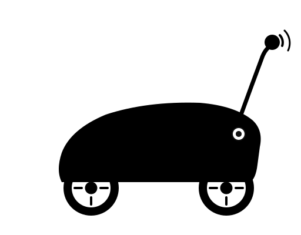

<picture>
	<source media="(prefers-color-scheme: dark)" srcset="docs/images/logos/logo-dark.svg">
	<source media="(prefers-color-scheme: light)" srcset="docs/images/logos/logo-light.svg">
	
</picture>

# dust-mite

dust-mite is an experimental platform for developing a self-driving RC car across multiple hardware and software configurations.

The primary objective is to evaluate platform trade-offs, compare implementation approaches, and iteratively improve system understanding.

## Why this project

- Evaluate multiple hardware and software combinations for a shared control objective.
- Support end-to-end system learning through implementation and validation.
- Maintain a practical architecture that is straightforward to extend.

## Variants

There are multiple dust-mite variants documented in [docs/variants.md](docs/variants.md).

## Development environment

Setup and contributor workflows are documented in [CONTRIBUTING.md](CONTRIBUTING.md).

## Backlog

Tasks and bugs are tracked in [GitHub Issues](https://github.com/ltowarek/dust-mite/issues).
