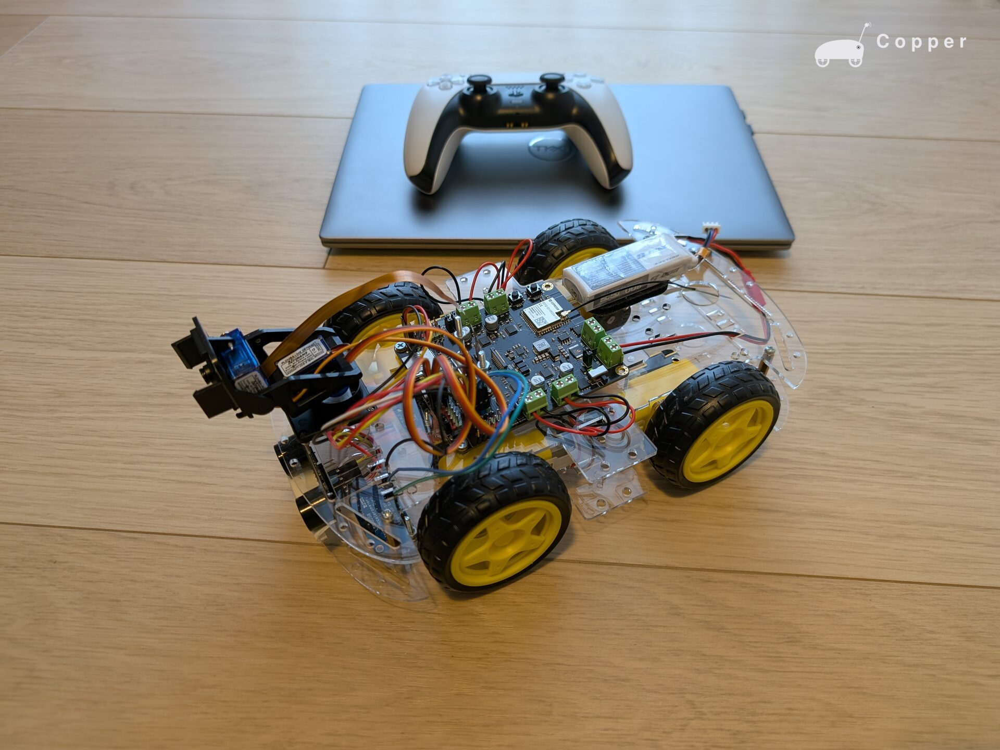
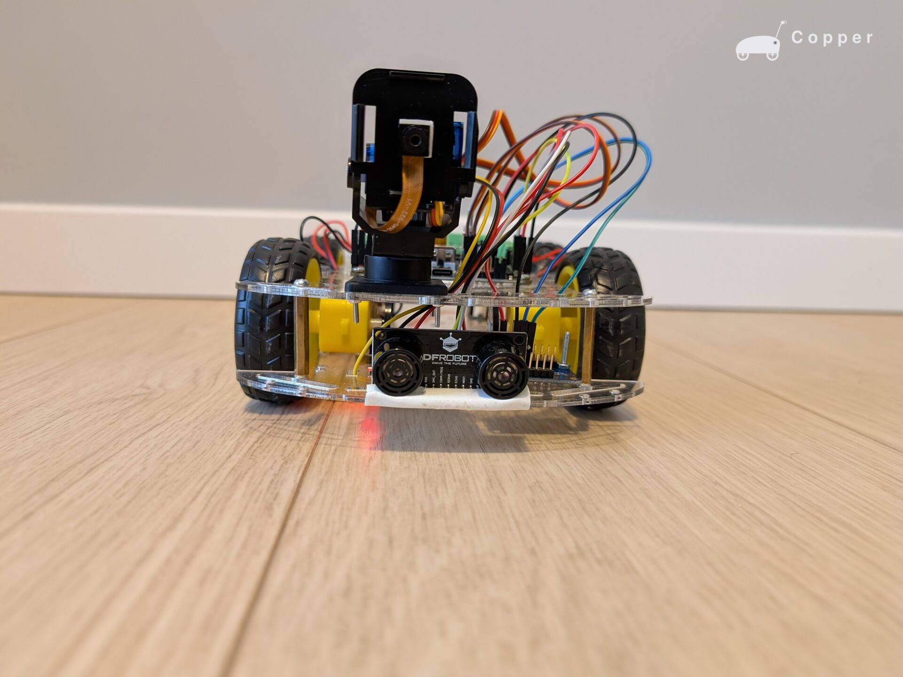
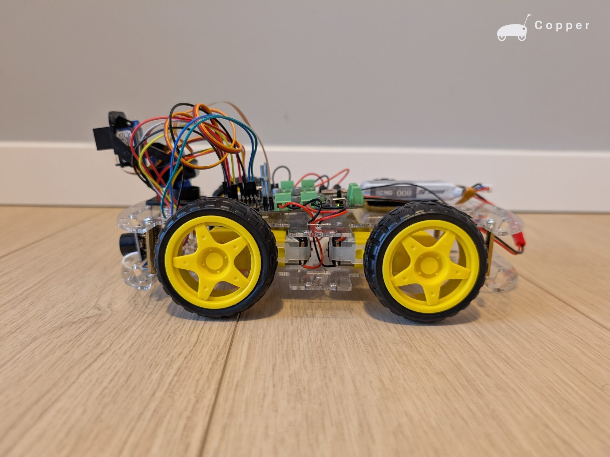
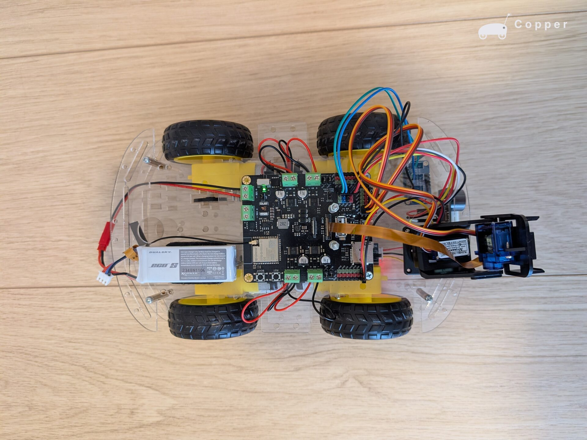
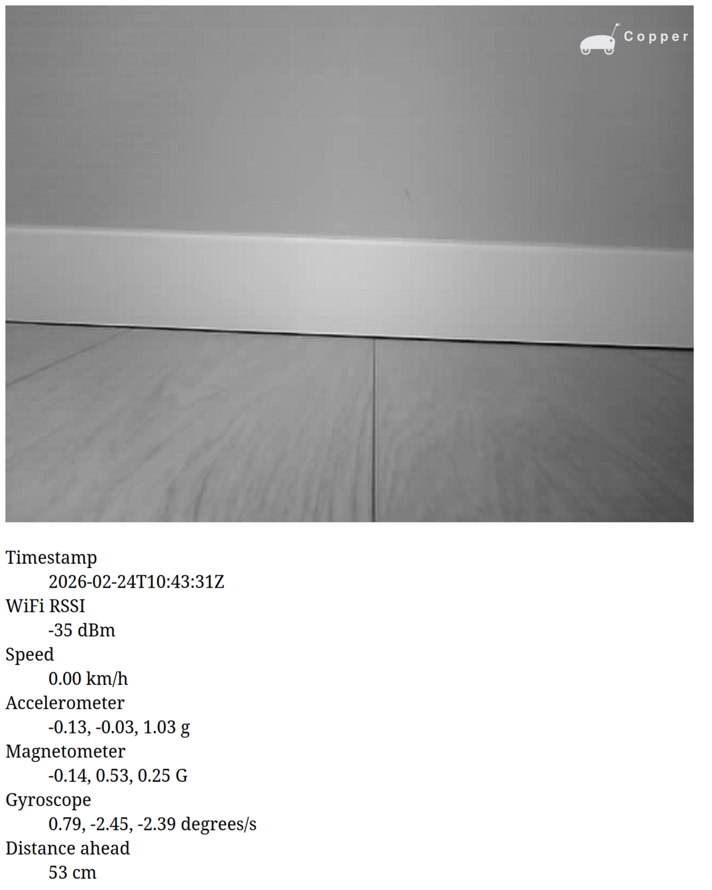
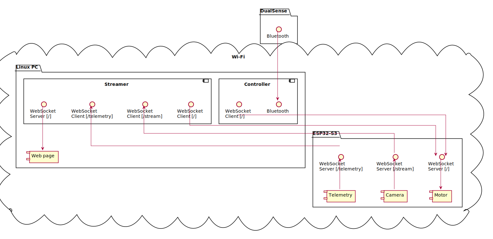

# Copper

`Copper` is a dust-mite variant built around an ESP32-S3 4WD chassis platform, with host-side control and visualization running on Linux. The ESP32 provides control, camera, and telemetry WebSocket endpoints, while Python services bridge robot data and DualSense input to a local browser dashboard.

## Images

## Bill of materials

| Qty | Item | Link |
| --- | --- | --- |
| 1 | DFRobot Romeo ESP32-S3 | [Product page](https://botland.com.pl/plytki-zgodne-z-arduino-dfrobot/24113-dfrobot-romeo-esp32-s3-plytka-rozwojowa-do-robotow-fpv-rc-car-z-kamera-6959420924127.html) |
| 1 | 4WD rectangular robot chassis | [Product page](https://botland.com.pl/podwozia-robotow/7289-chassis-rectangle-4wd-4-kolowe-podwozie-robota-z-napedem-5904422310127.html) |
| 1 | Waveshare slot sensor 12225 | [Product page](https://botland.com.pl/czujniki-odbiciowe/8834-czujnik-szczelinowy-waveshare-12225-5904422366292.html) |
| 1 | LSM9DS1 9DoF IMU (Adafruit 3387) | [Product page](https://botland.com.pl/czujniki-9dof-imu/8441-lsm9ds1-9dof-imu-3-osiowy-akcelerometr-zyroskop-i-magnetometr-i2cspi-adafruit-3387-5904422336516.html) |
| 1 | URM37 V5 ultrasonic distance sensor | [Product page](https://botland.com.pl/ultradzwiekowe-czujniki-odleglosci/3413-ultradzwiekowy-czujnik-odleglosci-urm37-v5-2-800cm-z-korekcja-temperaturowa-6959420907632.html) |
| 1 | Micro pan-tilt mount | [Product page](https://botland.com.pl/chwytaki-uchwyty-gimbale/3724-uchwyt-do-serw-micro-pantilt-z-miejscem-na-kamere-plastikowy-5904422332167.html) |
| 2 | TowerPro SG-90 micro servo | [Product page](https://botland.com.pl/produkty-wycofane/484-serwo-towerpro-sg-90-micro-180-stopni-5904422329488.html) |
| 1 | Dualsky Li-Pol battery 800mAh 25C 2S 7.4V | [Product page](https://botland.com.pl/akumulatory-li-pol-2s-74v-/2393-pakiet-li-pol-dualsky-800mah-25c-2s-74v-eco-s-6941047104655.html) |
| 1 | Self-adhesive hook-and-loop strap 50x30 mm (5-pack) | [Product page](https://botland.com.pl/rzepy-do-akumulatorow/585-rzep-samoprzylepny-50x30-mm-5-pak-6941047103054.html) |
| 1 | JST-BEC power cable | [Product page](https://botland.com.pl/przewody-i-zlacza-zasilajace/1340-przewod-zasilajacy-z-gniazdem-jst-bec-5904422373047.html) |
| as needed | Connecting cables | — |

## Getting started

- Set up devcontainers as described in [CONTRIBUTING.md](../../CONTRIBUTING.md).
- Pair the DualSense controller as described in [docs/hw/dual_sense.md](../hw/dual_sense.md).
- Enable device passthrough in devcontainers:
	- DualSense for Python container.
	- ESP32 for C++ container.
- Robot setup:
	- Disconnect the battery.
	- Connect the dev board to the PC through USB.
	- Build the firmware and flash the board.
	- Disconnect the USB.
	- Connect the battery.
	- Set JP1 jumper to **ON**.
	- Turn on the robot.
- Host setup:
	- In the Python devcontainer, open `/workspace/controller`.
	- In one terminal, run `python src/controller/controller.py`.
	- In another terminal, run `python src/controller/streamer.py`.
	- Open [src/controller/web/index.html](../../controller/src/controller/web/index.html) in a web browser (the page connects to `ws://localhost:8765`).
- After successful setup, the robot can be controlled with the DualSense controller, and telemetry plus camera feed can be monitored on the web page.

## HW notes

- **JP1 jumper position:**
	- Battery operation: JP1 must be **ON**.
	- USB connection to the PC: JP1 must be **OFF**.
- **JST-BEC polarity warning:** the connector had inverted wire colors in this setup. Connect **black wire to `+`** and **red wire to `-`** on the development board.
- **USB-only power behavior:** when powered from USB only, the board turns off after some time. When powered from the battery, this issue is not observed.

## SW notes

- In `Copper`, the ESP32 handles motor actuation and exposes three WebSocket endpoints: `/` (control), `/stream` (camera), and `/telemetry` (telemetry).
- Steering is skid-steering, with left/right drive commands generated from host-side input.
- On the Linux host, `controller.py` reads PS5 DualSense input and sends commands to `CONTROLLER_CLIENT_URI`.
- On the Linux host, `streamer.py` reads camera frames from `STREAM_CLIENT_URI`, telemetry from `TELEMETRY_CLIENT_URI`, processes frames with OpenCV, and publishes packets to a local WebSocket server at `ws://localhost:8765`.
- `streamer.py` can also send automatic brake commands to `CONTROLLER_CLIENT_URI` when `distance_ahead` is below the configured threshold.
- The web page in `src/controller/web/index.html` connects to `ws://localhost:8765` and displays the processed camera stream with live telemetry.

### Components

