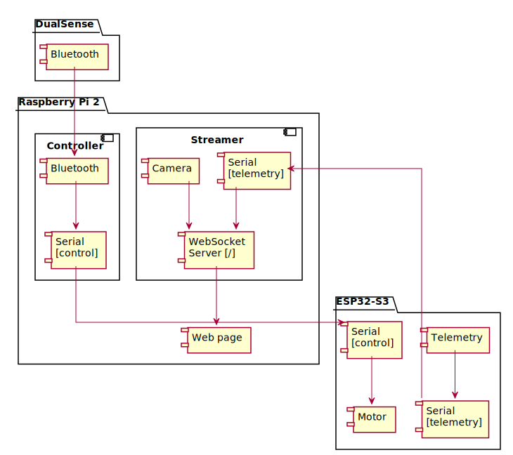

# Iron

`Iron` is a dust-mite variant built around Raspberry Pi 2 and ESP32-S3.
Raspberry Pi 2 hosts the complete control and streaming stack, and the DualSense controller is paired directly with Raspberry Pi 2 over Bluetooth.
ESP32-S3 is dedicated to low-level hardware control: motor drivers, pan-tilt servos, and sensors.
Raspberry Pi 2 exchanges control and telemetry packets with ESP32-S3 over a serial link, captures video from the Raspberry Pi camera, and publishes telemetry and video stream data to client browsers over WebSockets.

## Images

No variant images are available yet.

## Bill of materials

| Qty | Item | Link |
| --- | --- | --- |
| 1 | Raspberry Pi 2 Model B (Wi-Fi official kit) | [Product page](https://botland.com.pl/produkty-wycofane/4267-zestaw-raspberry-pi-2-model-b-wifi-official.html) |
| 1 | TP-Link UB500 Bluetooth adapter | [Product page](https://www.mediaexpert.pl/komputery-i-tablety/akcesoria-komputerowe/adaptery-bluetooth/adapter-tp-link-ub500) |
| 1 | Raspberry Pi Camera HD | [Product page](https://botland.com.pl/produkty-wycofane/1613-raspberry-pi-camera-hd-kamera-dla-raspberry-pi.html) |
| 1 | ESP32-S3 Dev Kit N8R8 (Waveshare 24243) | [Product page](https://botland.com.pl/moduly-wifi-i-bt-esp32/23341-esp32-s3-dev-kit-n8r8-plytka-rozwojowa-wifi-bluetooth-waveshare-24243.html) |
| 1 | Standard servo pan-tilt bracket | [Product page](https://botland.com.pl/uchwyty-i-mocowania-do-serw/13500-uchwyt-do-serw-standard-pantilt-5904422358686.html) |
| 2 | Feetech FS5106B standard servo | [Product page](https://botland.com.pl/serwa-typu-standard/9298-serwo-feetech-fs5106b-standard-0-200-stopni-5904422313135.html) |
| 1 | Raspberry Pi camera ribbon cable, 30 cm, 15-pin | [Product page](https://botland.com.pl/tasmy-ffc-i-obudowy-do-kamer-do-raspberry-pi/1909-tasma-raspberry-pi-kamera-30cm-15-zyl-raster-1mm-5904422307707.html) |
| 1 | DFRobot Baron 4WD robot chassis | [Product page](https://botland.com.pl/podwozia-robotow/5967-dfrobot-baron-4wd-4-kolowe-podwozie-robota-z-napedem-6959420907342.html) |
| 1 | Gravity TT Motor Encoders Kit (SEN0038) | [Product page](https://botland.com.pl/gravity-enkodery-i-potencjometry/19899-gravity-tt-motor-encoders-kit-zestaw-enkoderow-do-silnika-tt-dfrobot-sen0038-6959420907755.html) |
| 1 | Dualsky Li-Pol battery 1800mAh 25C 2S 7.4V | [Product page](https://botland.com.pl/akumulatory-li-pol-2s-74v-/12884-pakiet-li-pol-dualsky-1800mah-25c-74v-6941047111707.html) |
| 1 | XT60 plug with 10 cm cable | [Product page](https://botland.com.pl/przewody-i-zlacza-zasilajace/7515-wtyk-xt60-z-przewodem-10cm-5904422310493.html) |
| 1 | Adjustable step-down converter 33V-25V 5A (DFR0205) | [Product page](https://botland.com.pl/przetwornice-step-down/15090-przetwornica-step-down-regulowana-33v-25v-5a-dfrobot-dfr0205-5904422323219.html) |
| 2 | DRV8835 dual DC motor driver (Pololu 2135) | [Product page](https://botland.com.pl/sterowniki-silnikow-dc/851-drv8835-dwukanalowy-sterownik-silnikow-11v12a-pololu-2135-5904422367220.html) |
| as needed | Connecting cables | — |

## Getting started

- Set up the development environment as described in [CONTRIBUTING.md](../../CONTRIBUTING.md).
- Pair the DualSense controller with Raspberry Pi 2 as described in [docs/hw/dual_sense.md](../hw/dual_sense.md).
- Prepare Raspberry Pi runtime according to [docs/hw/rpi.md](../hw/rpi.md).
- Build and flash ESP32-S3 firmware in the C++ devcontainer.
- Start camera, control, and serial bridge services on Raspberry Pi 2.
- Open the web interface hosted on Raspberry Pi 2 from a client web browser.

## HW notes

- ESP32-S3 is dedicated to low-level hardware control: motors, servos, and sensors.
- Raspberry Pi 2 handles camera capture, network communication, and control/telemetry bridging.
- ESP32-S3 and Raspberry Pi 2 communicate through a serial interface.

## SW notes

- DualSense is connected directly to Raspberry Pi 2 over Bluetooth.
- Raspberry Pi 2 processes local controller input and converts commands to the serial control protocol for ESP32-S3.
- ESP32-S3 executes motor and servo actions and returns sensor packets over serial.
- Raspberry Pi 2 merges serial sensor data with camera stream data and publishes outbound WebSocket packets for user monitoring.

### Components

